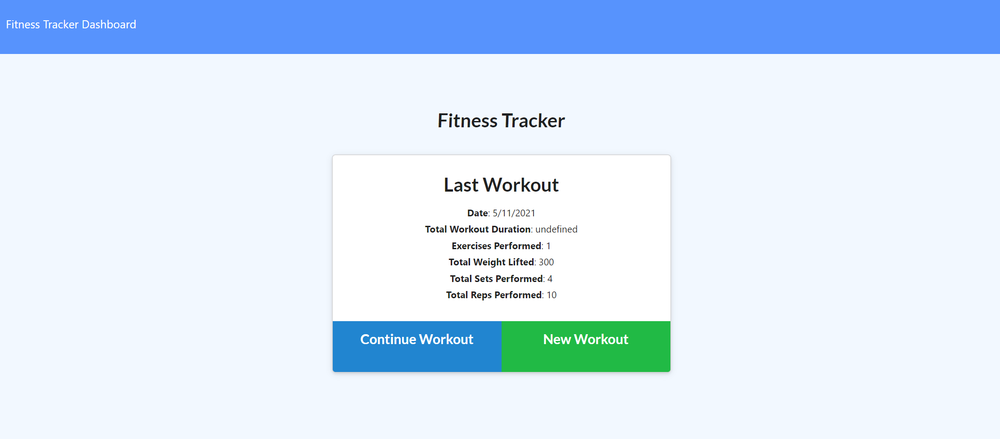
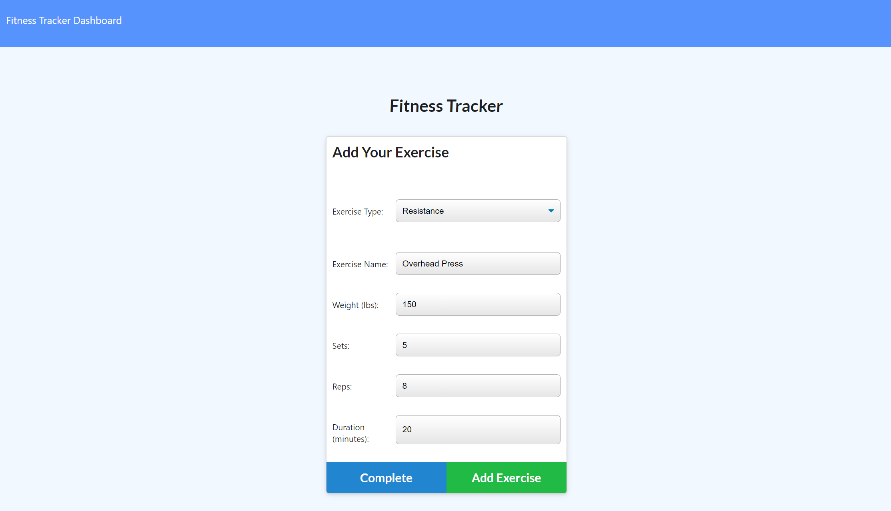
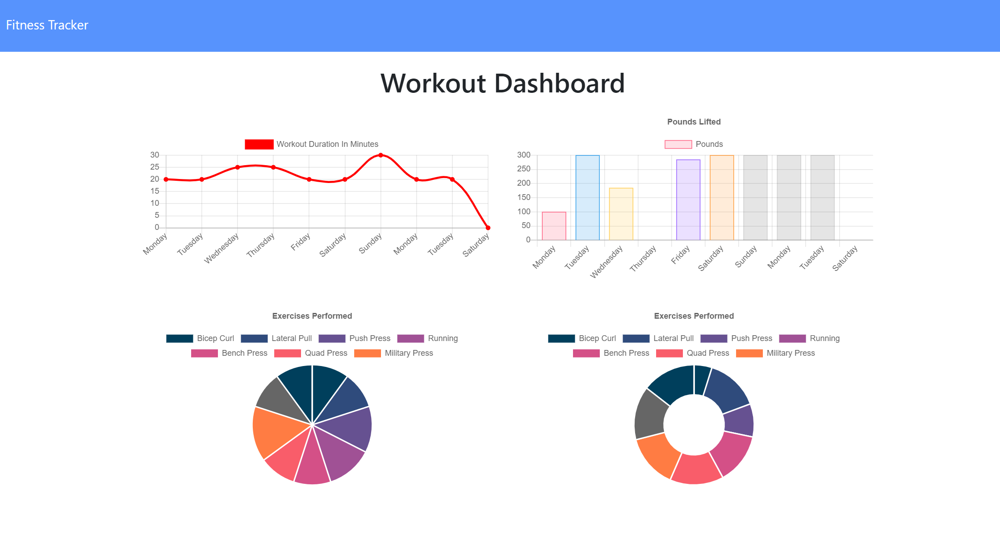

# 17_WorkoutTracker

For this assignment, you'll create a workout tracker. You have already been provided with the front end code in the `Develop` folder. This assignment will require you to create Mongo database with a Mongoose schema and handle routes with Express.

### Table of Contents:

- [Deployed Site](#deployed-site)
- [User Story](#user-story)
- [Description](#description)
- [Usage](#Usage)
- [Mock-Up](#Mock-Up)

## Deployed Site

[Production Link](https://lit-waters-77274.herokuapp.com/)

## User Story

As a user, I want to be able to view create and track daily workouts. I want to be able to log multiple exercises in a workout on a given day. I should also be able to track the name, type, weight, sets, reps, and duration of exercise. If the exercise is a cardio exercise, I should be able to track my distance traveled.

## Description

This app is for anyone who's looking for an easy way to track and review their exercises. It allows the user to add new workouts with multiple exercises per workout, then review their past 7 days of workouts with helpful charts and graphs to visualize the data.

Click the link below for a video walkthrough.

**[Video Walkthrough](https://drive.google.com/file/d/1cExvMqMYtTPaDDYwuTMDWbKiqYW5sRw5/view?usp=sharing)**

## Usage

Open the [Workout Tracker](https://lit-waters-77274.herokuapp.com/) in a web browser.

## Mock-Up

These images show the Workout Tracker's appearance and functionality:

## Installation

Open the app in any web browser to use it's features.

## License

- MIT License
- Copyright (c) Gabe Quakkelaar 2021
